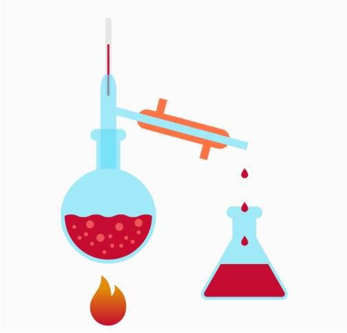
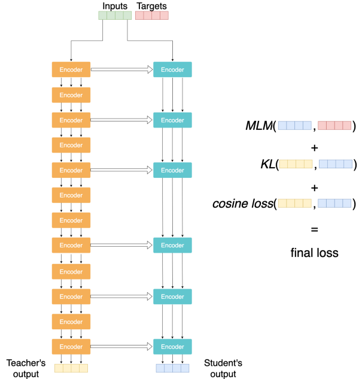

<div align="center">

# Bert Distillation



[](https://www.codefactor.io/repository/github/pussymipt/bert-distillation)


This project is about BERT distillation.

The goal is to distillate any BERT based on any language with convenient high-level API, reproducibility and all new GPU's features.

</div>

### Features
- various losses
- distributed training
- fp16
- logging with tensorboard, wandb etc
- catalyst framework

### A Brief Inquiry



Not so far ago Hugging Face team published [paper](https://arxiv.org/abs/1910.01108) about DistilBERT model. 
The idea is to transfer knowledge from big student model to smaller student model.

First of all we need a well trained teacher model.

Let's take 6 encoders instead of 12! 
We should initialize our small model's layers with teachers layers.

Instead of train our model for a long time on masked language model task we can add to our casual loss KL divergence and cosine loss between student and teacher as we know that a teacher is well trained.

As shown in the paper this method leads to small quality decreasing, reduce model size and speed up inference especially on mobile devices.

## Usage
In catalyst framework there are two ways to run your experiment: Notebook API and Config API.
If you wanna run a quick flexible experiment yo should use Notebook API,
but if you want to make product-ready solution you should use Config API.

### Notebook API
Let's briefly take a look on a Notebook API. First of all we should do all necessary imports:
```python
from catalyst import dl
from catalyst.contrib.data.nlp import LanguageModelingDataset
from catalyst.core import MetricAggregationCallback
import pandas as pd
import torch
from torch.utils.data import DataLoader
from transformers import (
    AutoConfig,
    AutoTokenizer,
    BertForMaskedLM,
    DistilBertForMaskedLM,
)
from transformers.data.data_collator import DataCollatorForLanguageModeling

from src.callbacks import (
    CosineLossCallback,
    KLDivLossCallback,
    MaskedLanguageModelCallback,
    MSELossCallback,
    PerplexityMetricCallbackDistillation,
)
from src.data import MLMDataset
from src.runners import DistilMLMRunner
from src.models import DistilbertStudentModel, BertForMLM
```

Then we should load our training data, for example:
```python
train_df = pd.read_csv("data/train.csv")
valid_df = pd.read_csv("data/valid.csv")
```

Next we should initialize our data loaders

```python
tokenizer = AutoTokenizer.from_pretrained("bert-base-uncased")  # your teacher's model tokenizer

train_dataset = LanguageModelingDataset(train_df["text"], tokenizer)
valid_dataset = LanguageModelingDataset(valid_df["text"], tokenizer)

collate_fn = DataCollatorForLanguageModeling(tokenizer).collate_batch
train_dataloader = DataLoader(
    train_dataset, collate_fn=collate_fn, batch_size=2
)
valid_dataloader = DataLoader(
    valid_dataset, collate_fn=collate_fn, batch_size=2
)
loaders = {"train": train_dataloader, "valid": valid_dataloader}
```

The most important thing is to define our models.

```python
teacher = BertForMLM("bert-base-uncased")
student = DistilbertStudentModel(
    teacher_model_name="bert-base-uncased",
    layers=[0, 2, 4, 7, 9, 11],  # which layers will be transfer to student
)
model = torch.nn.ModuleDict({"teacher": teacher, "student": student})
```

The next thing is callbacks:
```python
callbacks = {
    "masked_lm_loss": MaskedLanguageModelCallback(),  # standard MLM loss
    "mse_loss": MSELossCallback(),  # MSE loss between student and children distributions on masked positions
    "cosine_loss": CosineLossCallback(),  # cosine loss between hidden states
    "kl_div_loss": KLDivLossCallback(),  # KL divergence between student and children distributions on masked positions 
    "loss": MetricAggregationCallback(
        prefix="loss",
        mode="weighted_sum",
        metrics={  # weights for final loss
            "cosine_loss": 1.0,
            "masked_lm_loss": 1.0,
            "kl_div_loss": 1.0,
            "mse_loss": 1.0,
        },
    ),
    "optimizer": dl.OptimizerCallback(),  # optim.step() and loss.backward() is here
    "perplexity": PerplexityMetricCallbackDistillation(),  # perplexity metric
}
```

Finally, run an experiment!

```python
runner = DistilMLMRunner()
optimizer = torch.optim.Adam(model.parameters(), lr=5e-5)
runner.train(
    model=model,
    optimizer=optimizer,
    loaders=loaders,
    verbose=True,
    num_epochs=10,  # epochs number
    callbacks=callbacks,
)
```

### Folders

1. `bin` - bash files for running pipelines
2. `configs` - just place configs here
3. `docker` - project Docker files for pure reproducibility
4. `requirements` - different project python requirements for docker, tests, CI, etc
5. `scripts` - data preprocessing scripts, utils, everything like `python scripts/.py`
6. `src` - model, experiment, etc - research

### Docker

I also add dockerfile.
```
git clone https://github.com/PUSSYMIPT/bert-distillation.git
cd bert-distillation
docker build -f docker/Dockerfile  # yields container id
docker run {your container id}
```


## Contribution

1. Clone repository
2. run `pip install -r requirements/requirements-dev.txt -r requirements/requirements.txt`
3. write some code
4. run `catalyst-make-codestyle`
5. run `catalyst-check-codestyle`
6. if exit code is not 0 refactor your code
7. commit!